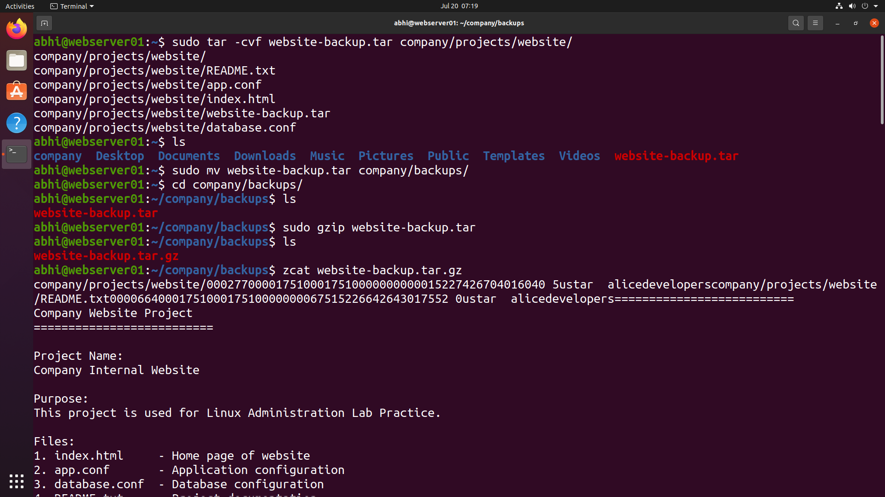
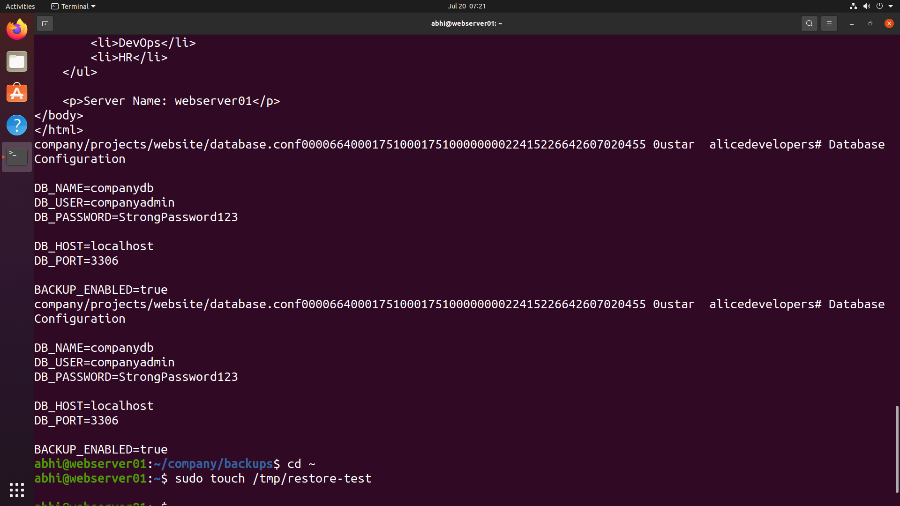
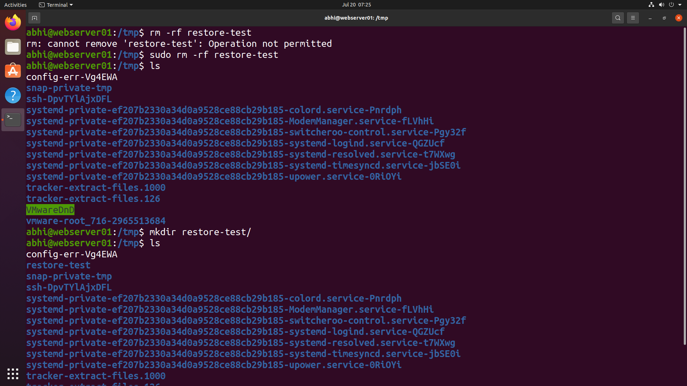
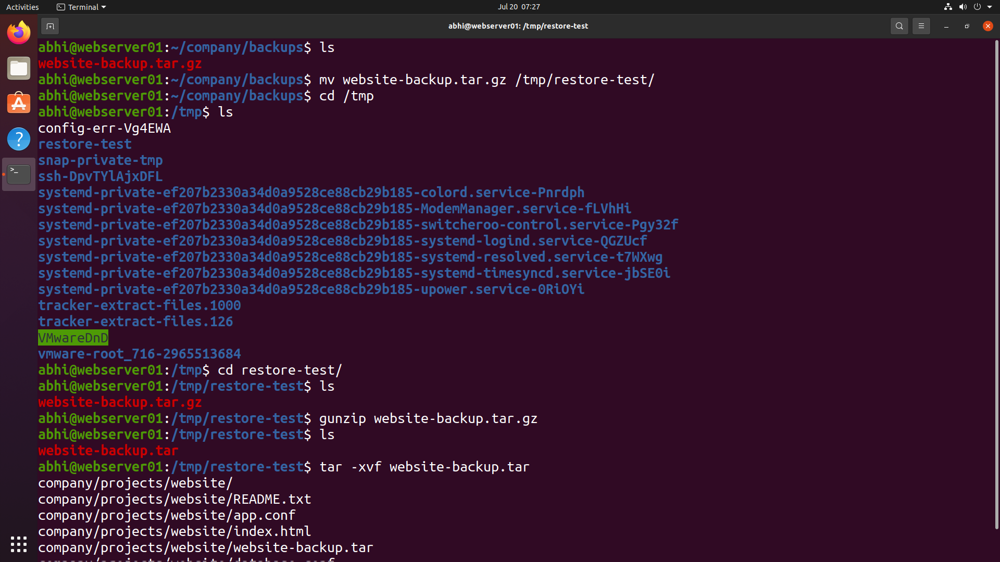
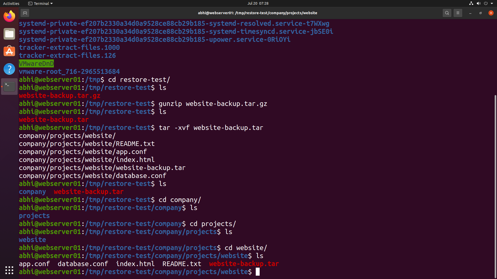

# 📦 Archiving & Backup

> **Module 11** of the **Linux Administration Lab**

## 📖 Overview

Archiving and Backup are essential tasks for Linux System Administrators to protect critical data from accidental deletion, corruption, or system failures. In this lab, I created a backup archive of the company website, compressed it to reduce storage usage, verified its contents, and successfully restored the backup to a different location.

---

## 🎯 Objectives

In this lab, I performed the following tasks:

- Create a TAR archive
- Move backup files to a backup directory
- Compress backup using Gzip
- Verify archive contents
- Restore archived data
- Validate restored files

---

## 💼 Real-World Scenario

You are working as a **Linux System Administrator** at **TechNova Pvt. Ltd.**

The development team requests a backup of the company website before deploying a major update. Your responsibility is to archive the website files, compress the backup for storage efficiency, and verify that the backup can be successfully restored if needed.

---

# 📋 Tasks Performed

## Task 1 – Create Website Backup

Created a TAR archive of the company website.

```bash
sudo tar -cvf website-backup.tar company/projects/website/
```

Moved the backup archive into the backup directory.

```bash
sudo mv website-backup.tar company/backups/
```

---

## Task 2 – Compress the Backup

Compressed the archive using Gzip.

```bash
sudo gzip website-backup.tar
```

Verified the archive contents.

```bash
zcat website-backup.tar.gz
```

---

## Task 3 – Prepare Restore Location

Created a temporary directory for backup restoration.

```bash
mkdir /tmp/restore-test
```

Moved the compressed backup into the restore location.

```bash
mv website-backup.tar.gz /tmp/restore-test/
```

---

## Task 4 – Restore Backup

Extracted the compressed archive.

```bash
gunzip website-backup.tar.gz
```

Extracted the TAR archive.

```bash
tar -xvf website-backup.tar
```

---

## Task 5 – Verify Restored Files

Verified that all website files were successfully restored.

```bash
ls company/projects/website
```

---

# 📸 Lab Execution

## Screenshot 1 – Creating Website Backup

Completed the following tasks:

- Created TAR archive
- Moved backup into backup directory
- Compressed archive using Gzip





---

## Screenshot 2 – Verifying Backup Archive

Completed the following tasks:

- Displayed compressed archive contents
- Verified backup integrity





---

## Screenshot 3 – Preparing Restore Environment

Completed the following tasks:

- Created restore directory
- Prepared restoration location





---

## Screenshot 4 – Restoring Backup

Completed the following tasks:

- Decompressed backup
- Extracted TAR archive





---

## Screenshot 5 – Verifying Restored Files

Completed the following tasks:

- Navigated to restored directory
- Verified website files after restoration





---

# 📁 Repository Structure

```text
11-archiving-backup/
├── README.md
└── screenshots/
    ├── create-backup.png
    ├── verify-backup.png
    ├── prepare-restore.png
    ├── restore-backup.png
    └── verify-restored-files.png
```

---

# 📚 Commands Practiced

```bash
tar -cvf
mv
gzip
zcat
mkdir
gunzip
tar -xvf
ls
```

---

# 🛠 Commands Explained

| Command | Purpose |
|----------|----------|
| `tar -cvf` | Create a TAR archive |
| `mv` | Move backup file to another directory |
| `gzip` | Compress archive |
| `zcat` | Display compressed archive contents |
| `mkdir` | Create restore directory |
| `gunzip` | Decompress Gzip archive |
| `tar -xvf` | Extract TAR archive |
| `ls` | Verify restored files |

---

# 🎓 Skills Practiced

- Linux Backup Administration
- TAR Archive Management
- File Compression
- Data Restoration
- Backup Verification
- Disaster Recovery Basics
- Linux File Management

---

# ✅ Outcome

After completing this lab, I successfully:

- Created a backup archive of the website.
- Compressed the archive to save storage space.
- Verified the backup contents.
- Restored the backup into a separate directory.
- Confirmed that all files were restored successfully.

---

# 📌 Key Takeaways

- Learned how to create TAR archives.
- Practiced compressing backups with Gzip.
- Understood the importance of backup verification.
- Successfully restored archived data.
- Gained hands-on experience with Linux backup and recovery procedures.

---

## 🚀 Next Module

➡️ **Module 12 – Log Management & System Monitoring**
