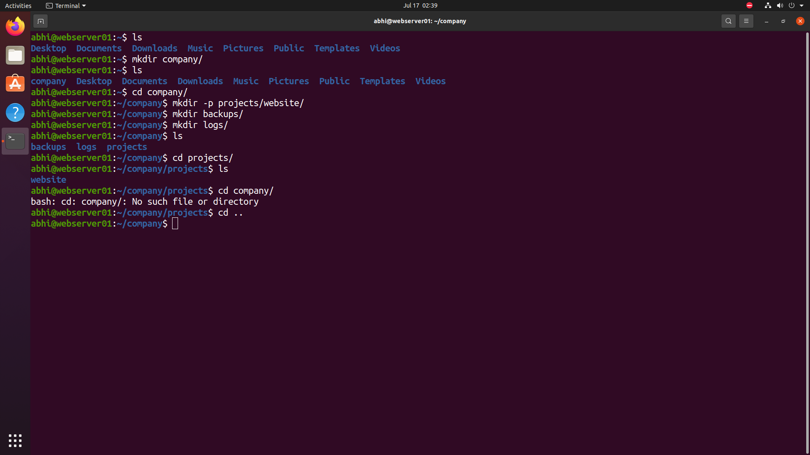
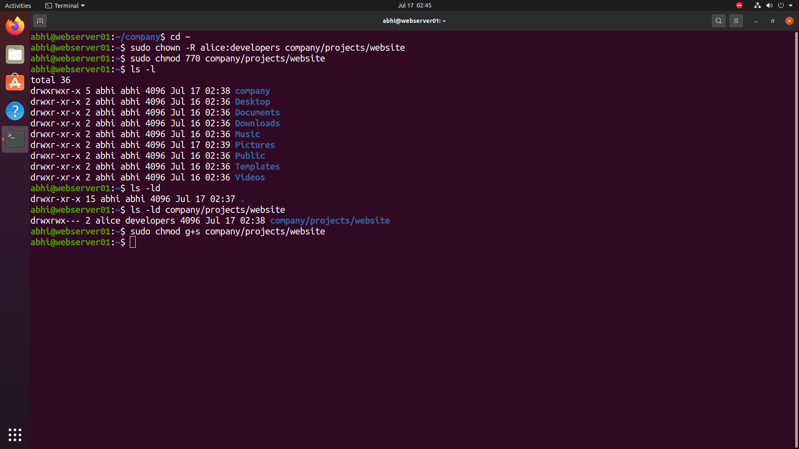

# 📁 Directory & Permission Management

> **Module 03** of the **Linux Administration Lab**

## 📖 Overview

Directory and Permission Management are fundamental responsibilities of a Linux System Administrator. In this lab, I created a structured directory hierarchy for a fictional company, configured ownership, assigned secure permissions, and prepared a shared workspace for the development team.

---

## 🎯 Objectives

In this lab, I performed the following tasks:

- Create a company directory structure
- Create nested project directories
- Create backup and log directories
- Assign ownership to users and groups
- Configure secure directory permissions
- Enable SGID for team collaboration
- Verify ownership and permissions

---

## 💼 Real-World Scenario

You are working as a **Linux System Administrator** at **TechNova Pvt. Ltd.**

The development team is about to start building a new company website. Before development begins, you need to prepare a secure directory structure where developers can collaborate while ensuring proper ownership and permissions.

---

# 🏢 Company Directory Structure

The following directory structure was created for the project.

```text
/company
│
├── projects
│   └── website
│
├── backups
│
└── logs
```

### Purpose of Each Directory

| Directory | Purpose |
|-----------|---------|
| `/company` | Root directory for company resources |
| `/company/projects` | Stores all company projects |
| `/company/projects/website` | Shared workspace for website development |
| `/company/backups` | Stores backup archives |
| `/company/logs` | Stores application and system logs |

---

# 📋 Commands Used

## Create Directory Structure

```bash
mkdir company

cd company

mkdir -p projects/website

mkdir backups

mkdir logs

ls

cd projects

ls
```

---

## Configure Ownership

Assign the website directory to the **alice** user and the **developers** group.

```bash
sudo chown -R alice:developers company/projects/website
```

---

## Configure Permissions

Grant full access to the owner and group while denying access to others.

```bash
sudo chmod 770 company/projects/website
```

Verify permissions.

```bash
ls -ld company/projects/website
```

---

## Enable SGID

Enable the SGID bit so that all newly created files inherit the **developers** group.

```bash
sudo chmod g+s company/projects/website
```

---

# 📸 Lab Execution

## Screenshot 1 – Directory Structure

The following tasks were completed:

- Created the company directory
- Created project directories
- Created backup directory
- Created log directory
- Verified the directory hierarchy



---

## Screenshot 2 – Ownership & Permission Configuration

The following tasks were completed:

- Changed ownership
- Configured directory permissions
- Verified ownership
- Enabled SGID



---

# 🔐 Permission Details

| Permission | Description |
|------------|-------------|
| **770** | Owner and group have full access, others have no access |
| **chown** | Changes file or directory ownership |
| **chmod** | Changes permissions |
| **g+s** | Enables SGID so new files inherit the directory's group |

---

# ✅ Outcome

After completing this lab, I successfully:

- Designed a structured company directory hierarchy
- Created project-specific directories
- Configured ownership using **chown**
- Applied secure permissions using **chmod**
- Enabled SGID for collaborative development
- Verified directory ownership and permissions

---

# 📁 Repository Structure

```text
03-directory-permission-management/
├── README.md
└── screenshots/
    ├── directory-management.png
    └── permission-management.png
```

---

# 📚 Commands Practiced

```bash
mkdir
mkdir -p
cd
ls
ls -ld
chown
chmod
chmod g+s
```

---

# 🎓 Skills Practiced

- Linux Directory Management
- Linux File Permissions
- File Ownership
- Group Ownership
- SGID Configuration
- Shared Directory Administration
- Linux Security Fundamentals

---

# 📌 Key Takeaways

- Created a professional directory hierarchy for a company project.
- Organized resources into projects, backups, and logs.
- Assigned ownership to users and groups.
- Configured secure directory permissions using **770**.
- Enabled SGID to simplify team collaboration.
- Verified directory ownership and permissions using Linux commands.

---

## 🚀 Next Module

➡️ **04 - File Management**
