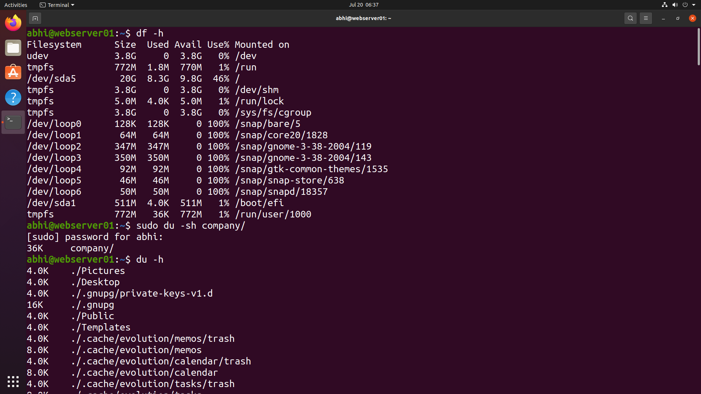
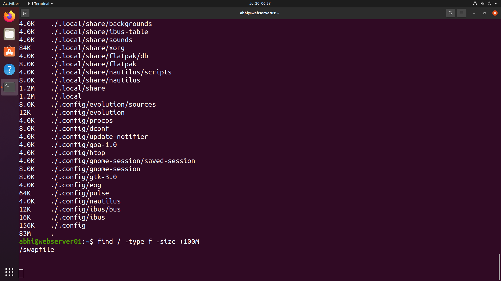

# 💽 Disk & Storage Monitoring

> **Module 10** of the **Linux Administration Lab**

## 📖 Overview

Disk and Storage Monitoring is a critical responsibility for Linux System Administrators. In this lab, I monitored disk space utilization, analyzed directory sizes, and located large files consuming storage using standard Linux utilities.

---

## 🎯 Objectives

In this lab, I performed the following tasks:

- Check filesystem disk usage
- Analyze directory sizes
- Find large files on the system
- Monitor storage utilization

---

## 💼 Real-World Scenario

You are working as a **Linux System Administrator** at **TechNova Pvt. Ltd.**

The operations team reports that the server is running low on storage space. Your responsibility is to identify filesystem usage, inspect directory sizes, and locate large files so storage issues can be resolved before they impact production services.

---

# 📋 Tasks Performed

## Task 1 – Check Disk Usage

Displayed disk usage for all mounted filesystems.

```bash
df -h
```

---

## Task 2 – Check Directory Size

Displayed the total size of the company directory.

```bash
sudo du -sh company/
```

Displayed disk usage for directories and files in the current location.

```bash
du -h
```

---

## Task 3 – Find Large Files

Searched the filesystem for files larger than 100 MB.

```bash
find / -type f -size +100M
```

---

# 📸 Lab Execution

## Screenshot 1 – Disk Usage & Directory Analysis

Completed the following tasks:

- Checked filesystem usage
- Measured directory size
- Displayed storage consumed by files and folders





---

## Screenshot 2 – Finding Large Files

Completed the following tasks:

- Located files larger than 100 MB
- Identified storage-consuming files





---

# 📁 Repository Structure

```text
10-disk-storage-monitoring/
├── README.md
└── screenshots/
    ├── disk-usage.png
    └── large-files.png
```

---

# 📚 Commands Practiced

```bash
df -h
du -sh company/
du -h
find / -type f -size +100M
```

---

# 🛠 Commands Explained

| Command | Purpose |
|----------|----------|
| `df -h` | Display disk space usage in human-readable format |
| `du -sh company/` | Display total size of the company directory |
| `du -h` | Display disk usage for directories and files |
| `find / -type f -size +100M` | Locate files larger than 100 MB |

---

# 🎓 Skills Practiced

- Disk Space Monitoring
- Storage Utilization Analysis
- Directory Size Monitoring
- Large File Identification
- Linux Filesystem Management
- Linux System Administration

---

# ✅ Outcome

After completing this lab, I successfully:

- Checked filesystem usage using `df`.
- Measured directory sizes using `du`.
- Analyzed storage consumption.
- Located large files using the `find` command.
- Gained practical experience monitoring Linux disk and storage resources.

---

# 📌 Key Takeaways

- Learned how to monitor available disk space.
- Identified storage usage across directories.
- Practiced finding files consuming significant disk space.
- Understood essential storage monitoring tools used by Linux administrators.
- Improved troubleshooting skills for disk space issues.

---

## 🚀 Next Module

➡️ **Module 11 – Archiving & Backup**
