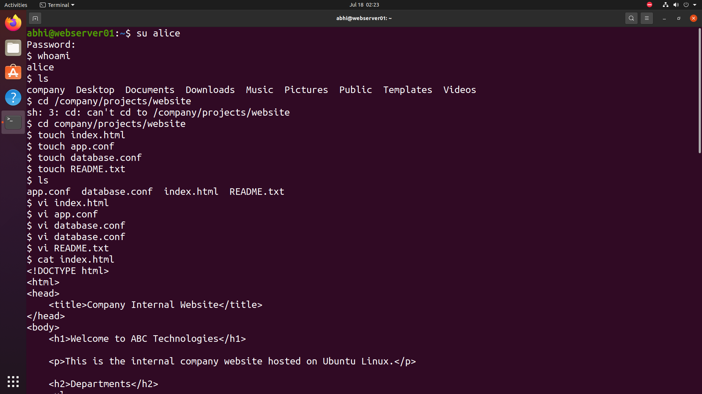
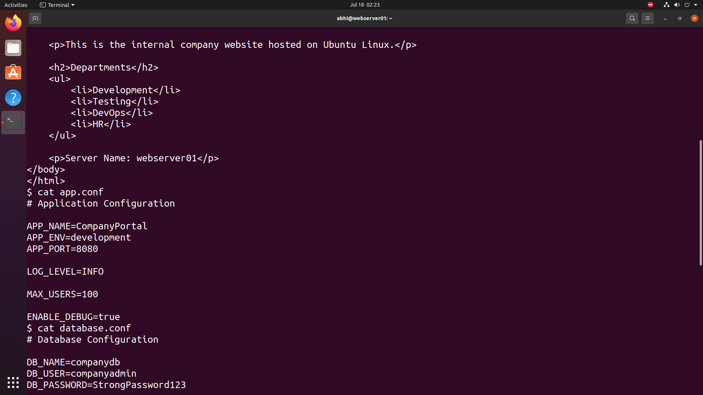
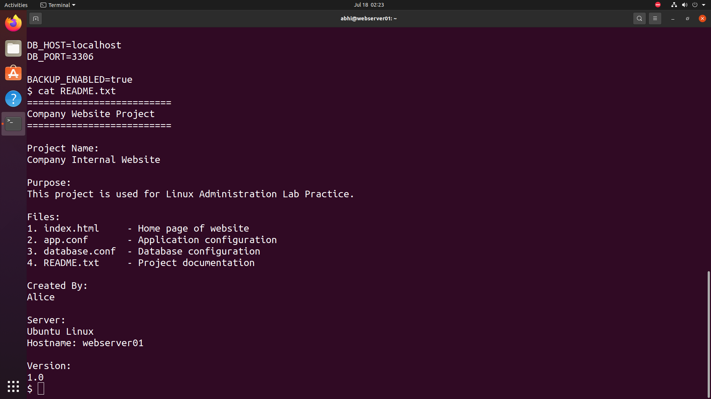
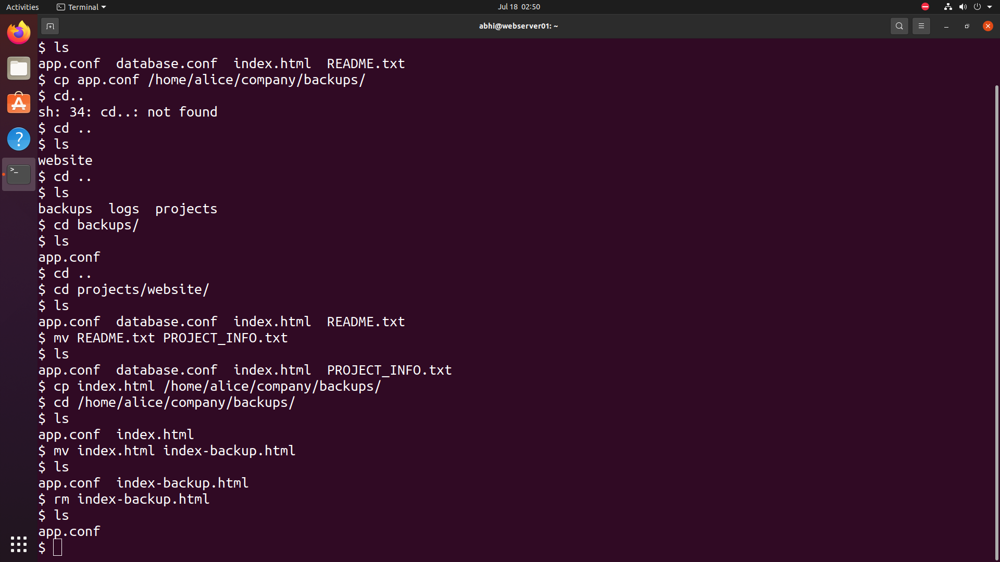

# 📄 File Management

> **Module 04** of the **Linux Administration Lab**

## 📖 Overview

File Management is a core Linux administration skill used to create, organize, maintain, and back up important files. In this lab, I created project files for a fictional company website, edited their contents, viewed file data, copied files to a backup location, renamed files, and removed unnecessary backup files.

---

## 🎯 Objectives

In this lab, I performed the following tasks:

- Create project files
- Edit file contents
- View file contents
- Copy files to a backup directory
- Rename files
- Delete unwanted files
- Verify file operations

---

## 💼 Real-World Scenario

You are working as a **Linux System Administrator** at **TechNova Pvt. Ltd.**

The development team has created a new internal company website. Your responsibility is to prepare the project files, maintain configuration files, create documentation, back up important files, and organize the project directory following standard Linux administration practices.

---

# 🏢 Project Structure

```text
company/
│
├── projects/
│   └── website/
│       ├── index.html
│       ├── app.conf
│       ├── database.conf
│       └── PROJECT_INFO.txt
│
├── backups/
│   └── app.conf
│
└── logs/
```

---

# 📋 Commands Used

## Create Project Files

```bash
touch index.html
touch app.conf
touch database.conf
touch README.txt
```

---

## Edit Files

```bash
vi index.html
vi app.conf
vi database.conf
vi README.txt
```

---

## View File Contents

```bash
cat index.html
cat app.conf
cat database.conf
cat README.txt
```

---

## Copy Files

```bash
cp app.conf /home/alice/company/backups/

cp index.html /home/alice/company/backups/
```

---

## Rename Files

```bash
mv README.txt PROJECT_INFO.txt

mv index.html index-backup.html
```

---

## Delete Files

```bash
rm index-backup.html
```

---

# 📸 Lab Execution

## Screenshot 1 – Creating Project Files

Completed the following tasks:

- Logged in as **alice**
- Navigated to the website project directory
- Created project files
- Verified the created files



---

## Screenshot 2 – Editing and Viewing Files

Completed the following tasks:

- Edited HTML page
- Created application configuration
- Created database configuration
- Created project documentation
- Verified file contents using `cat`



---

## Screenshot 3 – Project Documentation

Displayed:

- Company website documentation
- Project information
- Server information
- Version details



---

## Screenshot 4 – Copy, Rename and Delete Files

Completed the following tasks:

- Copied configuration files to backup directory
- Verified backup files
- Renamed project documentation
- Renamed HTML backup
- Deleted unnecessary backup file
- Verified final directory contents



---

# 📁 Repository Structure

```text
04-file-management/
├── README.md
└── screenshots/
    ├── create-files.png
    ├── edit-files.png
    ├── project-documentation.png
    └── file-operations.png
```

---

# 📚 Commands Practiced

```bash
touch
vi
cat
ls
cp
mv
rm
cd
```

---

# 🎓 Skills Practiced

- Linux File Management
- File Creation
- File Editing
- File Viewing
- File Copy Operations
- File Renaming
- File Deletion
- Backup Management
- Project Documentation

---

# ✅ Outcome

After completing this lab, I successfully:

- Created project files for a company website.
- Edited HTML and configuration files.
- Verified file contents using Linux commands.
- Created project documentation.
- Backed up important configuration files.
- Renamed project files following naming conventions.
- Removed unnecessary backup files.
- Verified all file operations.

---

# 📌 Key Takeaways

- Practiced essential Linux file management commands.
- Organized files in a structured company project.
- Maintained project documentation.
- Performed backup operations using `cp`.
- Managed files using `mv` and `rm`.
- Verified each operation to ensure data integrity.

---

## 🚀 Next Module

➡️ **Module 05 – Package Management**
