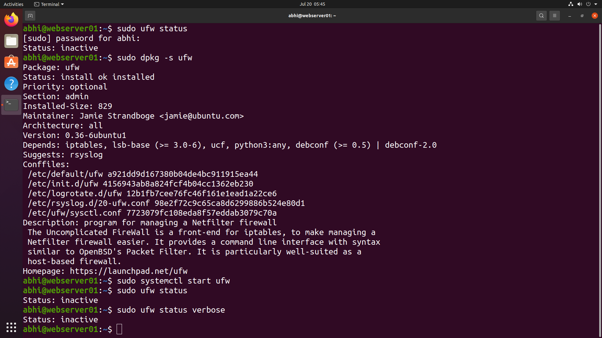
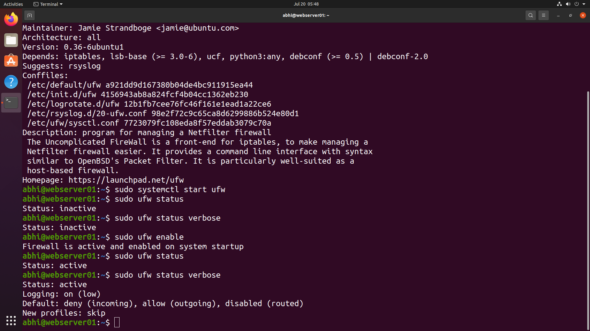
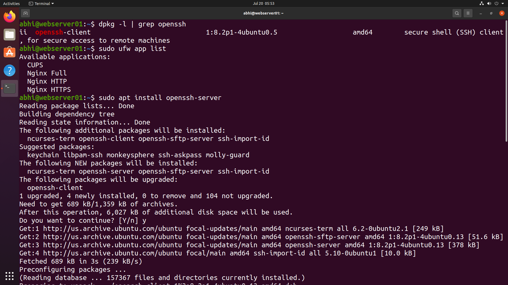
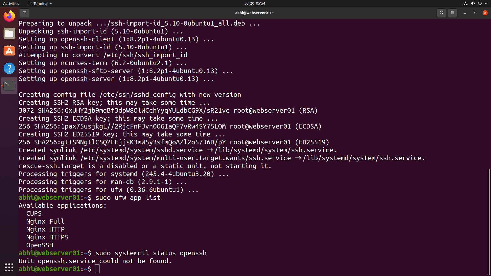
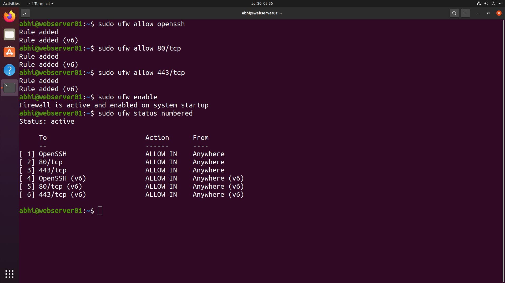

# 🔥 Firewall Administration (UFW)

> **Module 08** of the **Linux Administration Lab**

## 📖 Overview

Firewall Administration is an essential responsibility of a Linux System Administrator. In this lab, I configured the **Uncomplicated Firewall (UFW)** to secure the Ubuntu server by enabling the firewall, verifying its status, installing and allowing SSH access, and permitting HTTP/HTTPS traffic for the Nginx web server.

---

## 🎯 Objectives

In this lab, I performed the following tasks:

- Verify UFW installation
- Check firewall status
- Enable the firewall
- View firewall configuration
- Install OpenSSH Server
- Allow SSH through the firewall
- Allow HTTP and HTTPS traffic
- Verify firewall rules

---

## 💼 Real-World Scenario

You are working as a **Linux System Administrator** at **TechNova Pvt. Ltd.**

The company requires the web server to be secured before deployment. Your responsibility is to configure the firewall so that:

- SSH remains accessible for remote administration.
- HTTP (80) and HTTPS (443) are allowed for the website.
- All unnecessary incoming connections remain blocked.

---

# 📋 Tasks Performed

## Task 1 – Verify UFW Installation

Checked the firewall status.

```bash
sudo ufw status
```

Verified that the UFW package was installed.

```bash
sudo dpkg -s ufw
```

Attempted to start the firewall service.

```bash
sudo systemctl start ufw
```

Checked detailed firewall status.

```bash
sudo ufw status verbose
```

---

## Task 2 – Enable the Firewall

Enabled UFW.

```bash
sudo ufw enable
```

Verified firewall status.

```bash
sudo ufw status
```

Displayed detailed firewall configuration.

```bash
sudo ufw status verbose
```

---

## Task 3 – Install OpenSSH Server

Verified existing SSH packages.

```bash
dpkg -l | grep openssh
```

Displayed available firewall application profiles.

```bash
sudo ufw app list
```

Installed OpenSSH Server.

```bash
sudo apt install openssh-server
```

Verified available firewall application profiles again.

```bash
sudo ufw app list
```

> **Note:** On Ubuntu, the SSH service is named **ssh**, so `systemctl status openssh` returns *Unit openssh.service could not be found*. The correct command is:

```bash
sudo systemctl status ssh
```

---

## Task 4 – Configure Firewall Rules

Allowed SSH access.

```bash
sudo ufw allow OpenSSH
```

Allowed HTTP traffic.

```bash
sudo ufw allow 80/tcp
```

Allowed HTTPS traffic.

```bash
sudo ufw allow 443/tcp
```

Enabled the firewall.

```bash
sudo ufw enable
```

Displayed all configured firewall rules.

```bash
sudo ufw status numbered
```

---

# 📸 Lab Execution

## Screenshot 1 – Firewall Verification

Completed the following tasks:

- Checked UFW status
- Verified package installation
- Displayed firewall information





---

## Screenshot 2 – Enabling the Firewall

Completed the following tasks:

- Enabled UFW
- Verified firewall status
- Displayed verbose firewall configuration





---

## Screenshot 3 – OpenSSH Installation

Completed the following tasks:

- Checked installed SSH packages
- Listed available UFW application profiles
- Installed OpenSSH Server





---

## Screenshot 4 – SSH Configuration

Completed the following tasks:

- Completed OpenSSH installation
- Verified firewall application profiles
- Checked SSH service availability





---

## Screenshot 5 – Firewall Rules

Completed the following tasks:

- Allowed OpenSSH
- Allowed HTTP (80)
- Allowed HTTPS (443)
- Displayed numbered firewall rules





---

# 📁 Repository Structure

```text
08-firewall-administration/
├── README.md
└── screenshots/
    ├── firewall-verification.png
    ├── enable-firewall.png
    ├── openssh-installation.png
    ├── ssh-configuration.png
    └── firewall-rules.png
```

---

# 📚 Commands Practiced

```bash
ufw status
ufw status verbose
ufw enable
ufw allow
ufw app list
ufw status numbered
dpkg -s
dpkg -l
grep
apt install
systemctl status
```

---

# 🛡️ Commands Explained

| Command | Purpose |
|----------|----------|
| `sudo ufw status` | Display firewall status |
| `sudo ufw status verbose` | Show detailed firewall configuration |
| `sudo dpkg -s ufw` | Verify UFW package installation |
| `sudo ufw enable` | Enable the firewall |
| `sudo ufw app list` | List available application profiles |
| `sudo apt install openssh-server` | Install the OpenSSH Server |
| `sudo ufw allow OpenSSH` | Allow SSH traffic |
| `sudo ufw allow 80/tcp` | Allow HTTP traffic |
| `sudo ufw allow 443/tcp` | Allow HTTPS traffic |
| `sudo ufw status numbered` | Display firewall rules with rule numbers |
| `sudo systemctl status ssh` | Check the SSH service status |

---

# 🎓 Skills Practiced

- UFW Firewall Administration
- Firewall Rule Management
- SSH Configuration
- Network Security
- Linux Package Management
- Service Verification
- Server Hardening

---

# ✅ Outcome

After completing this lab, I successfully:

- Verified the UFW firewall installation.
- Enabled and configured the firewall.
- Installed the OpenSSH Server.
- Allowed secure remote SSH access.
- Configured HTTP and HTTPS firewall rules.
- Verified active firewall rules.
- Improved the security of the Ubuntu web server.

---

# 📌 Key Takeaways

- Learned how to manage Ubuntu's UFW firewall.
- Configured firewall rules for essential services.
- Secured SSH access before enabling the firewall.
- Allowed web traffic for the Nginx server.
- Verified firewall configuration using numbered rules.
- Gained practical experience in Linux server security.

---

## 🚀 Next Module

➡️ **Module 09 – Process Management**
