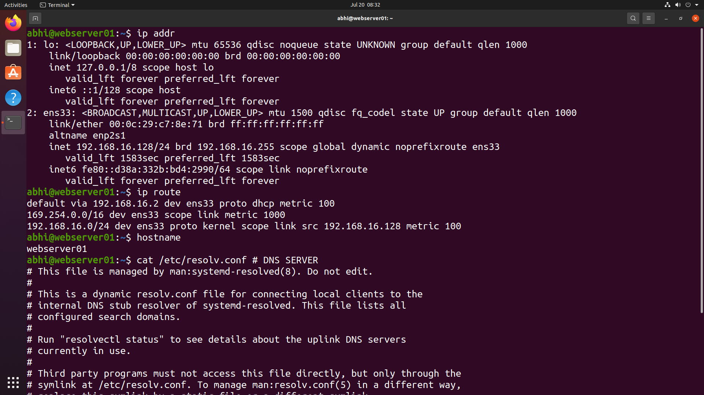
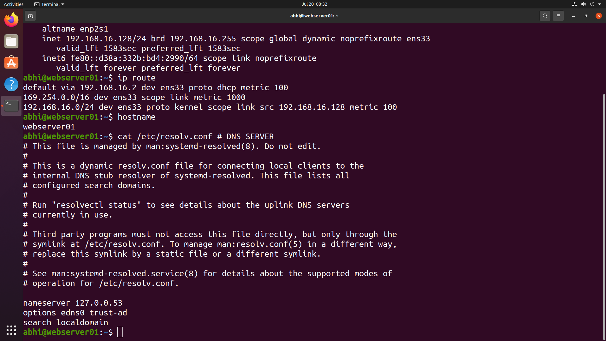
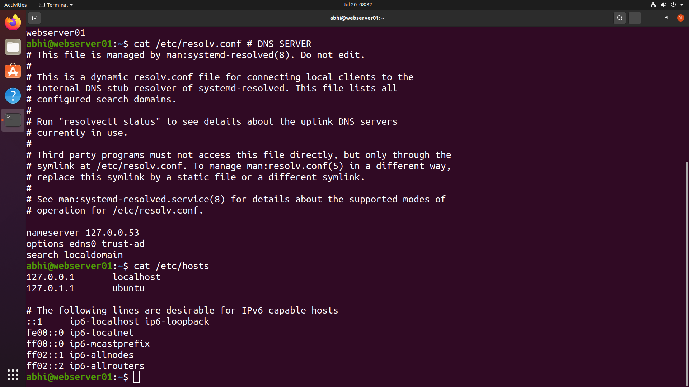
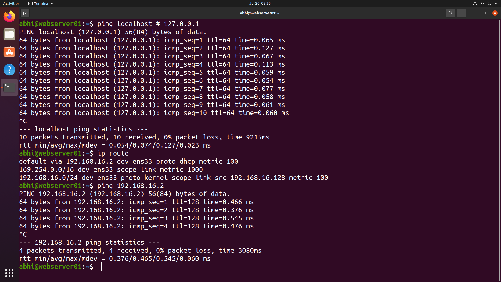
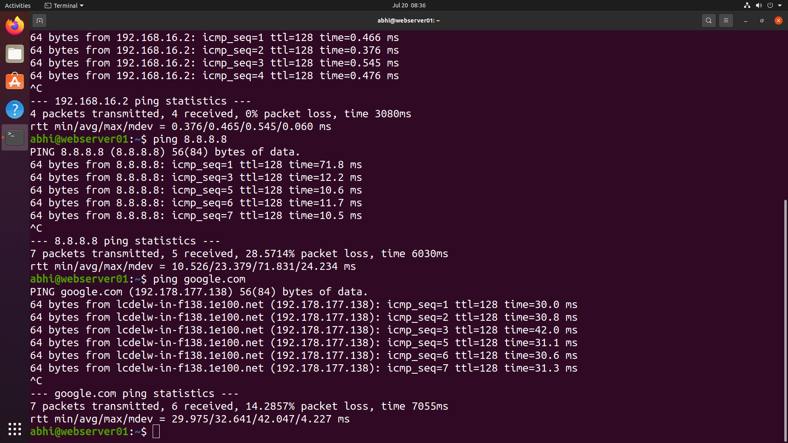
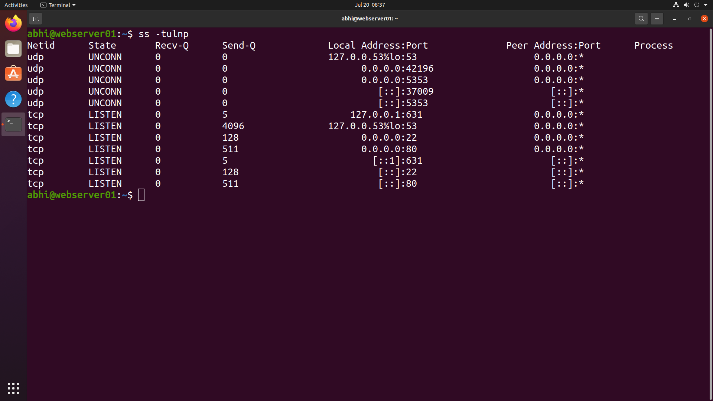

# 🌐 Networking & Connectivity

> **Module 13** of the **Linux Administration Lab**

## 📖 Overview

Networking is a fundamental responsibility of every Linux System Administrator. Proper network configuration and connectivity verification ensure that servers can communicate with clients, gateways, DNS servers, and external services.

In this lab, I explored network interface configuration, routing information, hostname resolution, DNS configuration, connectivity testing, and active network ports using Linux networking utilities.

---

## 🎯 Objectives

In this lab, I performed the following tasks:

- View network interface information
- Display routing table
- Verify hostname configuration
- Check DNS server configuration
- View hosts file
- Test local and external connectivity
- Verify default gateway connectivity
- Test DNS name resolution
- Display listening ports and services

---

## 💼 Real-World Scenario

You are working as a **Linux System Administrator** at **TechNova Pvt. Ltd.**

A newly deployed Ubuntu web server needs to be verified before going into production. Your responsibility is to inspect the server's network configuration, validate DNS settings, confirm connectivity to internal and external networks, and ensure that required services are listening on the correct ports.

---

# 📋 Tasks Performed

## Task 1 – View Network Configuration

Displayed network interface details.

```bash
ip addr
```

Displayed routing table.

```bash
ip route
```

Displayed hostname.

```bash
hostname
```

---

## Task 2 – Verify DNS Configuration

Displayed configured DNS resolver.

```bash
cat /etc/resolv.conf
```

Displayed local hostname mappings.

```bash
cat /etc/hosts
```

---

## Task 3 – Test Network Connectivity

Verified localhost connectivity.

```bash
ping localhost
```

Verified default gateway connectivity.

```bash
ping 192.168.16.2
```

Verified Internet connectivity.

```bash
ping 8.8.8.8
```

Verified DNS name resolution.

```bash
ping google.com
```

---

## Task 4 – Check Listening Ports

Displayed active TCP and UDP listening ports.

```bash
ss -tulnp
```

---

# 📸 Lab Execution

## Screenshot 1 – Network Configuration

Completed the following tasks:

- Displayed network interfaces
- Viewed IP addresses
- Displayed routing table
- Verified hostname





---

## Screenshot 2 – DNS Configuration

Completed the following tasks:

- Viewed DNS resolver configuration
- Displayed hosts file





---

## Screenshot 3 – Local & Gateway Connectivity

Completed the following tasks:

- Tested localhost connectivity
- Verified default gateway communication





---

## Screenshot 4 – Internet Connectivity

Completed the following tasks:

- Tested Internet connectivity
- Verified communication with Google's public DNS server
- Tested DNS name resolution







---

## Screenshot 5 – Network Ports

Completed the following tasks:

- Displayed listening TCP ports
- Displayed listening UDP ports
- Verified running network services





---

# 📁 Repository Structure

```text
13-networking-connectivity/
├── README.md
└── screenshots/
    ├── network-configuration.png
    ├── dns-configuration.png
    ├── local-connectivity.png
    ├── internet-connectivity.png
    └── network-ports.png
```

---

# 📚 Commands Practiced

```bash
ip addr
ip route
hostname
cat /etc/resolv.conf
cat /etc/hosts
ping localhost
ping <gateway-ip>
ping 8.8.8.8
ping google.com
ss -tulnp
```

---

# 🛠 Commands Explained

| Command | Purpose |
|----------|----------|
| `ip addr` | Display network interfaces and IP addresses |
| `ip route` | Show routing table and default gateway |
| `hostname` | Display system hostname |
| `cat /etc/resolv.conf` | View DNS resolver configuration |
| `cat /etc/hosts` | Display local hostname mappings |
| `ping localhost` | Test loopback interface |
| `ping <gateway-ip>` | Verify gateway connectivity |
| `ping 8.8.8.8` | Test Internet connectivity without DNS |
| `ping google.com` | Verify DNS resolution and Internet access |
| `ss -tulnp` | Display listening TCP/UDP ports and associated services |

---

# 🌐 Connectivity Tests Performed

| Test | Purpose |
|------|---------|
| Localhost | Verify loopback interface |
| Default Gateway | Verify local network communication |
| Public IP (8.8.8.8) | Verify Internet connectivity |
| Domain Name (google.com) | Verify DNS resolution |
| Listening Ports | Verify active network services |

---

# 🎓 Skills Practiced

- Linux Networking
- IP Address Configuration
- Routing Table Analysis
- DNS Configuration
- Hostname Resolution
- Network Troubleshooting
- Connectivity Testing
- Port Monitoring
- Service Verification
- Linux Server Administration

---

# ✅ Outcome

After completing this lab, I successfully:

- Inspected network interface configuration.
- Verified IP addressing and routing.
- Reviewed DNS resolver configuration.
- Examined the hosts file.
- Tested localhost, gateway, Internet, and DNS connectivity.
- Identified active network services and listening ports.
- Practiced essential Linux networking troubleshooting techniques.

---

# 📌 Key Takeaways

- Learned how Linux manages network interfaces and routing.
- Understood how DNS resolution works.
- Verified different layers of network connectivity.
- Practiced troubleshooting using standard networking commands.
- Learned to inspect active services using the `ss` utility.

---

## 🚀 Next Module

➡️ **Module 14 – Redirection & Cronjobs**
