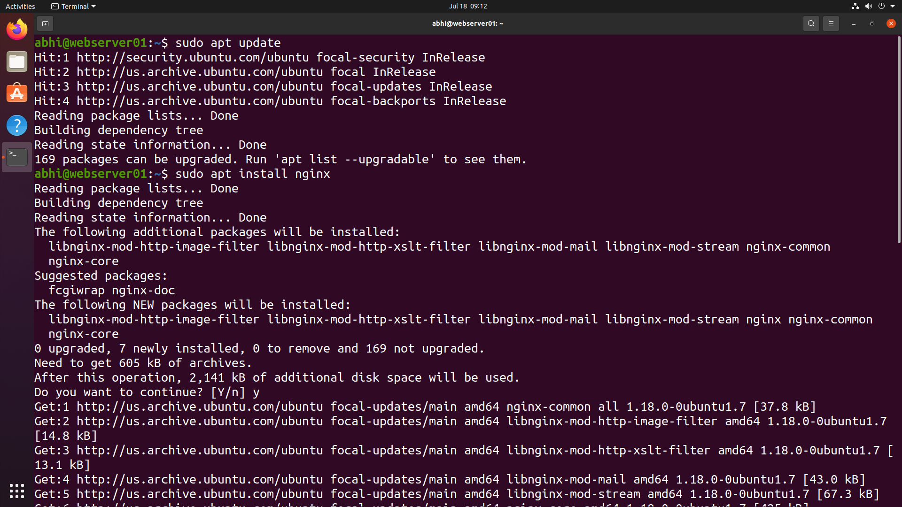
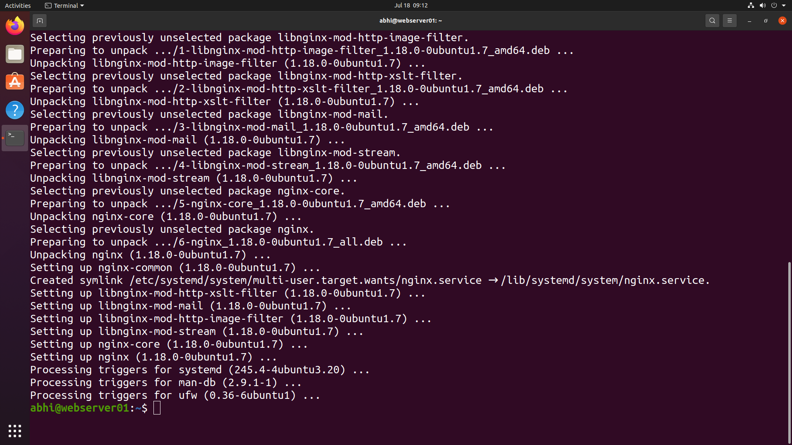
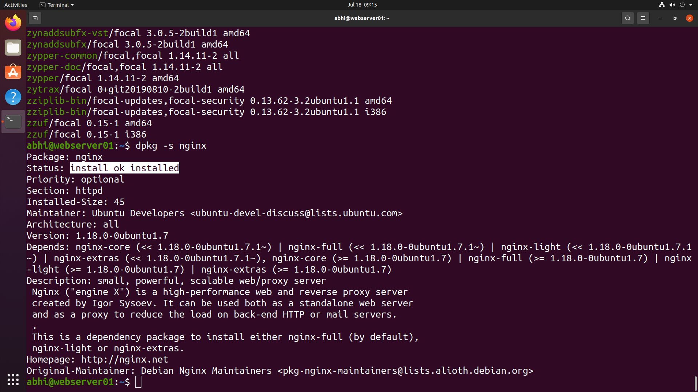

# 📦 Package Management

> **Module 05** of the **Linux Administration Lab**

## 📖 Overview

Package Management is an essential responsibility of a Linux System Administrator. It involves maintaining software repositories, installing required packages, verifying successful installations, and managing software updates.

In this lab, I updated the Ubuntu package repository, installed the **Nginx** web server, and verified the installation using Debian package management tools.

---

## 🎯 Objectives

In this lab, I performed the following tasks:

- Update the package repository
- Install a software package
- Resolve package dependencies automatically
- Verify package installation
- View installed package information
- Understand APT and DPKG package management

---

## 💼 Real-World Scenario

You are working as a **Linux System Administrator** at **TechNova Pvt. Ltd.**

A new Ubuntu web server has been deployed for hosting the company's internal website. Before the web application can be deployed, the required software packages must be installed and verified.

Your responsibility is to:

- Synchronize package repositories
- Install the Nginx web server
- Verify that the package has been installed successfully
- Confirm package details for future maintenance

---

# 📋 Tasks Performed

## Task 1 – Update Package Repository

Refresh the local package index from Ubuntu repositories.

```bash
sudo apt update
```

---

## Task 2 – Install Nginx

Install the Nginx web server along with all required dependencies.

```bash
sudo apt install nginx
```

---

## Task 3 – Verify Package Installation

Display package information and verify that the package has been installed successfully.

```bash
dpkg -s nginx
```

Expected output:

```text
Status: install ok installed
```

---

# 📸 Lab Execution

## Screenshot 1 – Updating Package Repository

The following tasks were completed:

- Updated Ubuntu package repository
- Refreshed package metadata
- Verified repository synchronization



---

## Screenshot 2 – Installing Nginx Package

The following tasks were completed:

- Installed the Nginx package
- Downloaded required dependencies
- Configured package automatically
- Completed package installation successfully



---

## Screenshot 3 – Verifying Package Installation

The following tasks were completed:

- Verified package installation using `dpkg`
- Confirmed package status
- Displayed package version
- Viewed package information



---

# 📁 Repository Structure

```text
05-package-management/
├── README.md
└── screenshots/
    ├── update.png
    ├── install.png
    └── verify.png
```

---

# 📚 Commands Practiced

```bash
apt update
apt install
dpkg -s
```

---

# 📦 Commands Explained

| Command | Purpose |
|----------|----------|
| `apt update` | Refresh package lists from Ubuntu repositories |
| `apt install nginx` | Install the Nginx web server package and dependencies |
| `dpkg -s nginx` | Display package status and installation details |

---

# 🎓 Skills Practiced

- Ubuntu Package Management
- APT Package Manager
- DPKG Package Verification
- Software Installation
- Dependency Management
- Repository Synchronization
- Linux Server Administration

---

# ✅ Outcome

After completing this lab, I successfully:

- Updated the Ubuntu package repository.
- Installed the Nginx web server package.
- Automatically installed required package dependencies.
- Verified successful package installation.
- Displayed package metadata and installation details.
- Gained hands-on experience with Ubuntu package management tools.

---

# 📌 Key Takeaways

- Learned how Ubuntu manages software packages using **APT**.
- Understood the importance of updating package repositories before installing software.
- Installed software along with its dependencies.
- Verified installed packages using **DPKG**.
- Practiced essential package management commands used in day-to-day Linux administration.

---

## 🚀 Next Module

➡️ **Module 06 – Service Management**
