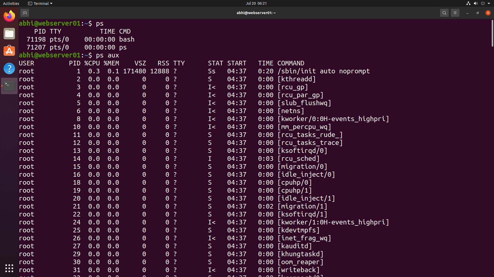
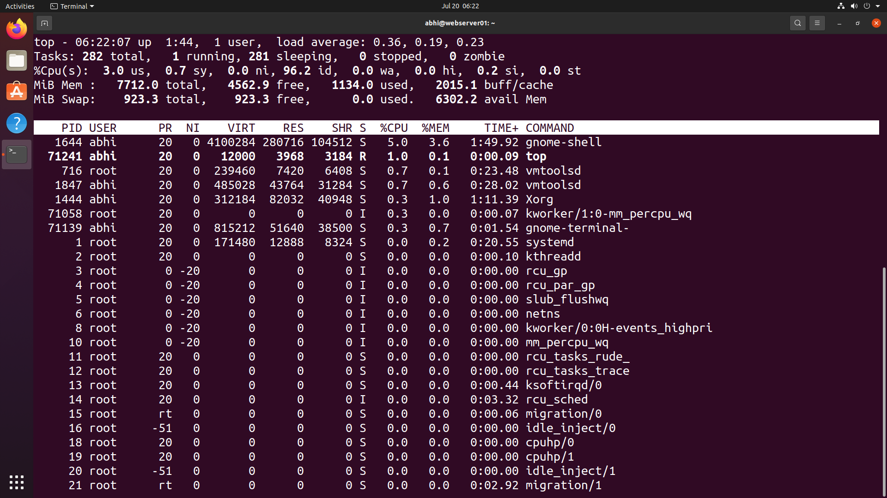
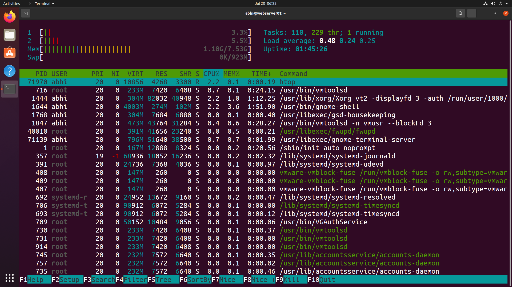
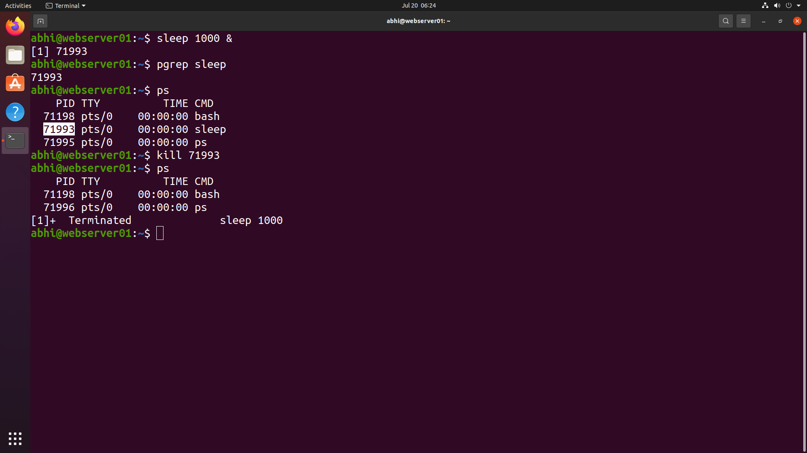

# ⚙️ Process Management

> **Module 09** of the **Linux Administration Lab**

## 📖 Overview

Process Management is one of the core responsibilities of a Linux System Administrator. In this lab, I learned how to monitor running processes, view system resource usage, identify process IDs (PIDs), create background processes, and terminate processes safely using various Linux commands.

---

## 🎯 Objectives

In this lab, I performed the following tasks:

- View running processes
- Display detailed process information
- Monitor CPU and memory usage
- Monitor processes interactively
- Create a background process
- Find a process using its name
- Terminate a running process

---

## 💼 Real-World Scenario

You are working as a **Linux System Administrator** at **TechNova Pvt. Ltd.**

Users have reported that the server is running slowly. Your responsibility is to investigate running processes, identify resource usage, monitor the system in real time, and terminate unnecessary processes if required.

---

# 📋 Tasks Performed

## Task 1 – View Running Processes

Displayed the processes running in the current terminal.

```bash
ps
```

Displayed detailed information about all running processes.

```bash
ps aux
```

---

## Task 2 – Monitor System Processes

Monitored CPU, memory, and running processes in real time.

```bash
top
```

Used an enhanced interactive process viewer.

```bash
htop
```

---

## Task 3 – Create a Background Process

Started a background process.

```bash
sleep 1000 &
```

Found the Process ID (PID).

```bash
pgrep sleep
```

Verified the running process.

```bash
ps
```

---

## Task 4 – Terminate a Process

Stopped the background process using its PID.

```bash
kill <PID>
```

Verified that the process had terminated.

```bash
ps
```

---

# 📸 Lab Execution

## Screenshot 1 – Viewing Running Processes

Completed the following tasks:

- Displayed current terminal processes
- Listed all running processes using `ps aux`

```markdown

```

---

## Screenshot 2 – Process Monitoring

Completed the following tasks:

- Monitored CPU usage
- Monitored memory usage
- Viewed running processes using `top`

```markdown

```

---

## Screenshot 3 – Interactive Process Monitoring

Completed the following tasks:

- Viewed processes using `htop`
- Monitored system resources interactively

```markdown

```

---

## Screenshot 4 – Background Process Management

Completed the following tasks:

- Started a background process
- Retrieved its PID
- Terminated the process
- Verified successful termination

```markdown

```

---

# 📁 Repository Structure

```text
09-process-management/
├── README.md
└── screenshots/
    ├── running-processes.png
    ├── top-command.png
    ├── htop.png
    └── background-process.png
```

---

# 📚 Commands Practiced

```bash
ps
ps aux
top
htop
sleep
pgrep
kill
```

---

# 🛠 Commands Explained

| Command | Purpose |
|----------|----------|
| `ps` | Display processes running in the current terminal |
| `ps aux` | Display detailed information about all running processes |
| `top` | Monitor CPU, memory, and running processes in real time |
| `htop` | Interactive process monitoring utility |
| `sleep 1000 &` | Start a background process |
| `pgrep sleep` | Find the PID of the sleep process |
| `kill <PID>` | Terminate a running process |

---

# 🎓 Skills Practiced

- Linux Process Management
- Process Monitoring
- CPU and Memory Monitoring
- Background Job Management
- Process Identification
- Process Termination
- Linux System Administration

---

# ✅ Outcome

After completing this lab, I successfully:

- Viewed running processes using `ps` and `ps aux`.
- Monitored system performance using `top`.
- Used `htop` for interactive process monitoring.
- Created and managed a background process.
- Identified processes using `pgrep`.
- Safely terminated a process using `kill`.

---

# 📌 Key Takeaways

- Learned how Linux manages running processes.
- Used different tools for monitoring system resources.
- Practiced creating and managing background jobs.
- Identified processes using their PID.
- Terminated processes safely using the `kill` command.
- Improved practical Linux system administration skills.

---

## 🚀 Next Module

➡️ **Module 10 – Disk & Storage Monitoring**
