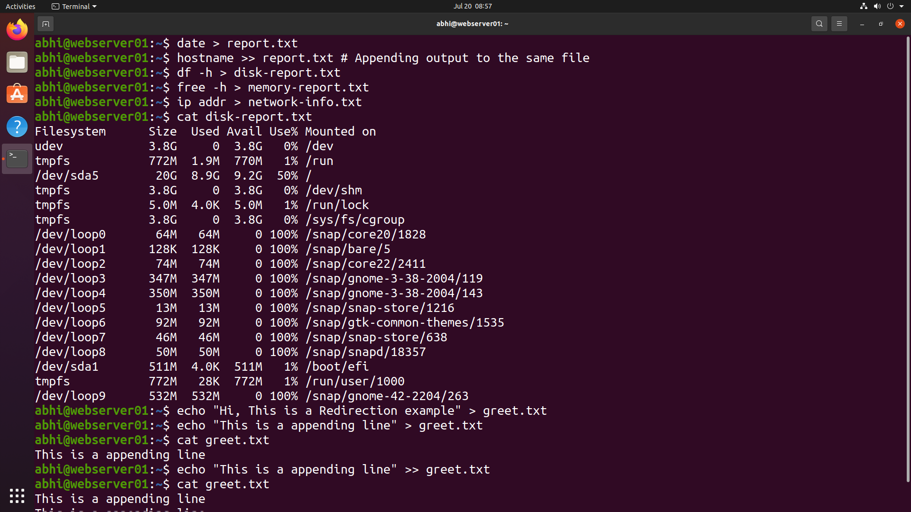
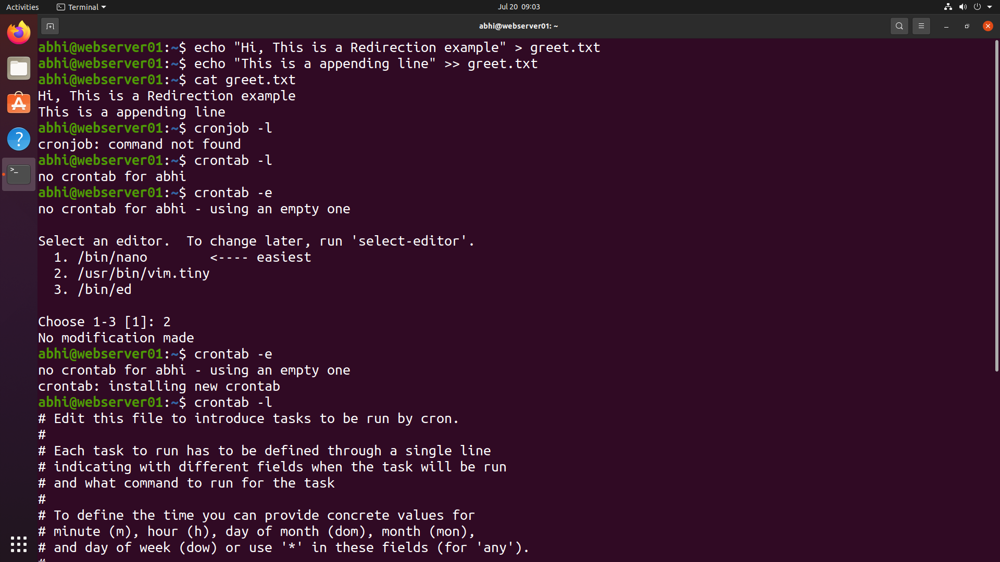
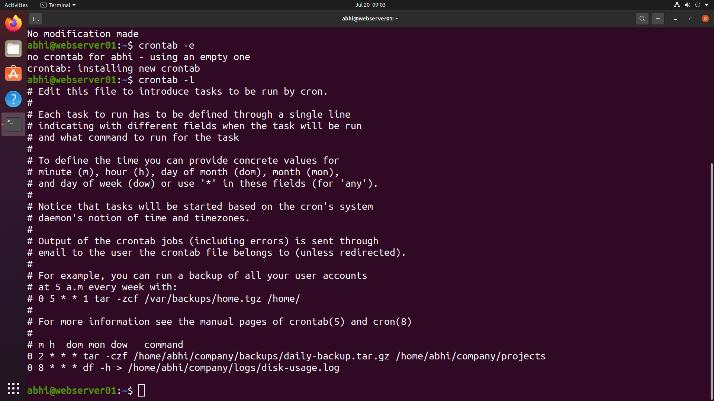

# Module 14 - Redirection & Cron Jobs

## 📖 Overview

In this module, I practiced Linux input/output redirection and task automation using Cron. I learned how to redirect command output to files, append data, redirect errors, and automate repetitive administrative tasks such as backups and system monitoring using `crontab`.

---

## 🎯 Objectives

- Redirect command output to files
- Append output without overwriting existing data
- Create system reports
- Practice standard output and standard error redirection
- Configure scheduled tasks using Cron
- Automate backups and disk monitoring

---

## 🛠️ Commands Used

```bash
date > report.txt
hostname >> report.txt

df -h > disk-report.txt
free -h > memory-report.txt
ip addr > network-info.txt

echo "Hi, This is a Redirection example" > greet.txt
echo "This is a appending line" >> greet.txt
cat greet.txt

crontab -l
crontab -e
```

---

## 📷 Lab Execution

### Screenshot 1 – Output Redirection

- Redirected command output to files
- Generated disk, memory, and network reports
- Created a text file using `>`
- Appended additional data using `>>`

```text
date > report.txt
hostname >> report.txt
df -h > disk-report.txt
free -h > memory-report.txt
ip addr > network-info.txt
echo "Hi, This is a Redirection example" > greet.txt
echo "This is a appending line" >> greet.txt
cat greet.txt
```



---

### Screenshot 2 – Cron Job Configuration

- Listed existing cron jobs
- Created a new crontab
- Configured scheduled backup task
- Configured automatic disk usage report

Example Cron Jobs:

```cron
0 2 * * * tar -czf /home/abhi/company/backups/daily-backup.tar.gz /home/abhi/company/projects

0 8 * * * df -h > /home/abhi/company/logs/disk-usage.log
```




---

## ✅ Outcome

Successfully learned to:

- Redirect command output into files
- Append data without overwriting existing content
- Generate system information reports
- Create reusable text reports
- Configure scheduled tasks using Cron
- Automate Linux administration tasks

---

## 📂 Directory Structure

```text
14-redirection-cronjobs/
│
├── README.md
└── screenshots/
    ├── redirection.png
    └── cronjobs.png
```

---

## 💻 Commands Practiced

| Command | Purpose |
|----------|---------|
| `>` | Redirect output to a file |
| `>>` | Append output to a file |
| `cat` | Display file contents |
| `date` | Display current date and time |
| `hostname` | Show system hostname |
| `df -h` | Display disk usage |
| `free -h` | Display memory usage |
| `ip addr` | Display network configuration |
| `crontab -e` | Edit cron jobs |
| `crontab -l` | List scheduled cron jobs |

---

## 🚀 Skills Practiced

- Linux Output Redirection
- File Handling
- Report Generation
- Standard Output Management
- Task Scheduling
- Cron Automation
- Backup Scheduling
- System Administration

---

## 📚 Key Takeaways

- `>` creates or overwrites a file.
- `>>` appends data without deleting existing content.
- Redirection is useful for logging and report generation.
- Cron automates repetitive administrative tasks.
- Scheduled backups and monitoring improve system reliability.

---

## 🎉 Project Completion

This module marks the completion of my **Linux Administration Lab Project**.

Throughout this project, I practiced essential Linux system administration tasks including:

- System Information
- User & Group Management
- Directory & Permission Management
- Package Management
- Service Management
- Firewall Configuration
- Process Monitoring
- Disk & Storage Monitoring
- Archiving & Backup
- Log Monitoring
- Networking & Connectivity
- Redirection & Cron Jobs

This hands-on lab strengthened my understanding of Linux administration by performing real-world tasks commonly used by System Administrators, Cloud Engineers, and DevOps Engineers.

---

## 📜 Skills Gained

- Linux Command Line
- User & Group Administration
- File Permissions
- Package Management
- Systemd Service Management
- Firewall (UFW)
- Process Monitoring
- Disk & Storage Analysis
- Log Analysis
- Networking Fundamentals
- Archiving & Backup
- Output Redirection
- Task Automation with Cron
- Basic System Troubleshooting

---

## 🚀 Final Outcome

This Linux Administration Lab demonstrates practical Linux administration skills through hands-on exercises and real-world scenarios. The project serves as a portfolio showcasing my ability to manage Linux systems, monitor resources, configure services, automate routine tasks, and troubleshoot common system issues.
