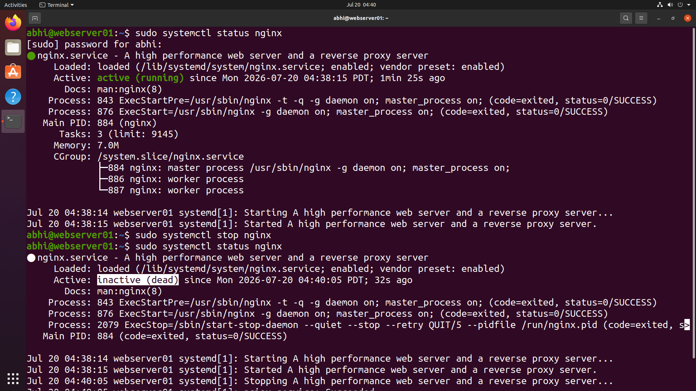
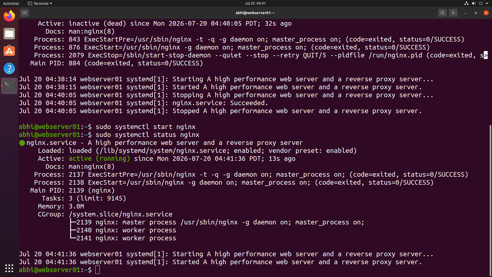
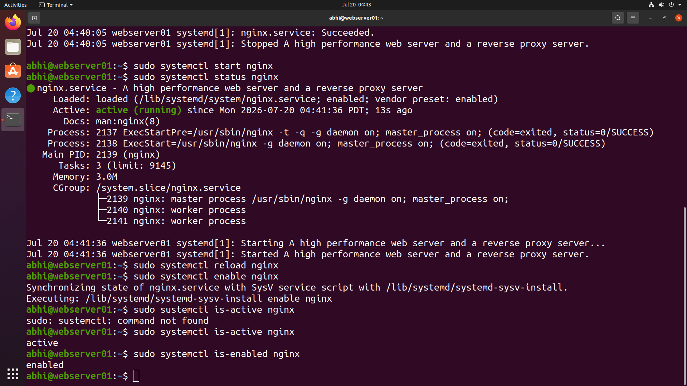
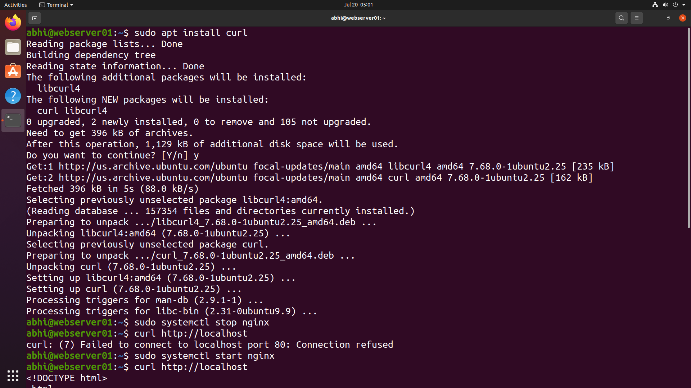
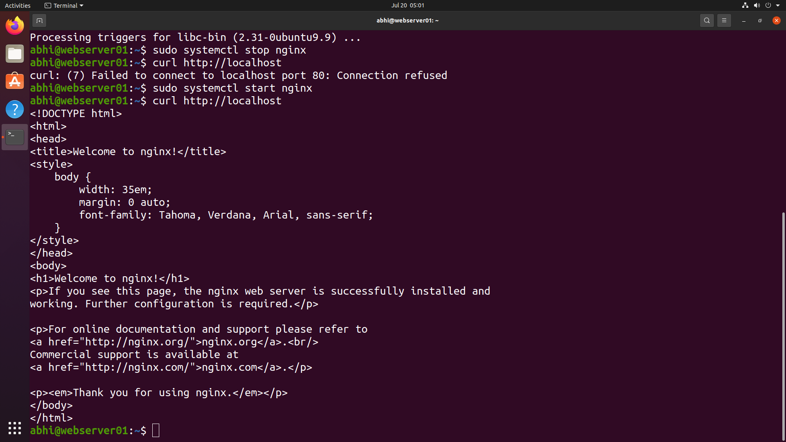

# ⚙️ Service Management

> **Module 06** of the **Linux Administration Lab**

## 📖 Overview

Service Management is a fundamental responsibility of a Linux System Administrator. System services are managed using **systemd** through the `systemctl` command. In this lab, I managed the **Nginx** web server service by checking its status, stopping and starting the service, reloading its configuration, enabling it at boot, and verifying that the web server was accessible.

---

## 🎯 Objectives

In this lab, I performed the following tasks:

- Check service status
- Stop a running service
- Start a stopped service
- Reload service configuration
- Enable a service at boot
- Verify service state
- Verify service boot configuration
- Test the web server using `curl`

---

## 💼 Real-World Scenario

You are working as a **Linux System Administrator** at **TechNova Pvt. Ltd.**

The company has deployed an internal web server using **Nginx**. As part of routine server administration, you must manage the web server service, ensure it starts automatically after system reboots, and verify that the website is accessible to users.

---

# 📋 Tasks Performed

## Task 1 – Check Service Status

Verify whether the Nginx service is running.

```bash
sudo systemctl status nginx
```

---

## Task 2 – Stop the Service

Stop the running web server.

```bash
sudo systemctl stop nginx
```

Verify the service status.

```bash
sudo systemctl status nginx
```

Expected output:

```text
Active: inactive (dead)
```

---

## Task 3 – Start the Service

Restart the web server.

```bash
sudo systemctl start nginx
```

Verify the service status.

```bash
sudo systemctl status nginx
```

Expected output:

```text
Active: active (running)
```

---

## Task 4 – Reload the Service

Reload the Nginx configuration without stopping the service.

```bash
sudo systemctl reload nginx
```

---

## Task 5 – Enable the Service

Configure Nginx to start automatically during system boot.

```bash
sudo systemctl enable nginx
```

---

## Task 6 – Verify Service State

Check whether the service is currently running.

```bash
sudo systemctl is-active nginx
```

Expected output:

```text
active
```

---

## Task 7 – Verify Boot Configuration

Check whether the service is enabled at startup.

```bash
sudo systemctl is-enabled nginx
```

Expected output:

```text
enabled
```

---

## Task 8 – Test the Web Server

Stop the service and verify that the website becomes unavailable.

```bash
sudo systemctl stop nginx

curl http://localhost
```

Expected output:

```text
curl: (7) Failed to connect to localhost port 80
```

Restart the service and verify website accessibility.

```bash
sudo systemctl start nginx

curl http://localhost
```

The HTML source of the default Nginx web page should be displayed.

---

# 📸 Lab Execution

## Screenshot 1 – Checking and Stopping the Service

Completed the following tasks:

- Checked Nginx service status
- Verified running state
- Stopped the service
- Verified inactive status

```text
screenshots/service-stop.png
```

```markdown

```

---

## Screenshot 2 – Starting the Service

Completed the following tasks:

- Started the Nginx service
- Verified active status
- Confirmed service processes

```markdown

```

---

## Screenshot 3 – Reloading and Enabling the Service

Completed the following tasks:

- Reloaded service configuration
- Enabled service at system boot
- Verified active status
- Verified boot configuration

```markdown

```

---

## Screenshot 4 – Testing Service Availability

Completed the following tasks:

- Installed curl
- Stopped the service
- Verified connection failure

```markdown

```

---

## Screenshot 5 – Verifying Website Accessibility

Completed the following tasks:

- Started the service
- Verified website accessibility
- Displayed the default Nginx page using curl

```markdown

```

---

# 📁 Repository Structure

```text
06-service-management/
├── README.md
└── screenshots/
    ├── service-stop.png
    ├── service-start.png
    ├── service-enable.png
    ├── service-test-failed.png
    └── service-test-success.png
```

---

# 📚 Commands Practiced

```bash
systemctl status
systemctl stop
systemctl start
systemctl reload
systemctl enable
systemctl is-active
systemctl is-enabled
curl
```

---

# ⚙️ Commands Explained

| Command | Purpose |
|----------|----------|
| `systemctl status nginx` | Display detailed service status |
| `systemctl stop nginx` | Stop the Nginx service |
| `systemctl start nginx` | Start the Nginx service |
| `systemctl reload nginx` | Reload configuration without stopping the service |
| `systemctl enable nginx` | Enable service at system startup |
| `systemctl is-active nginx` | Check whether the service is running |
| `systemctl is-enabled nginx` | Check whether the service starts automatically at boot |
| `curl http://localhost` | Test whether the web server is responding |

---

# 🎓 Skills Practiced

- Linux Service Management
- systemd Administration
- Nginx Service Control
- Service Monitoring
- Boot-Time Service Configuration
- Service Verification
- Web Server Availability Testing

---

# ✅ Outcome

After completing this lab, I successfully:

- Monitored the Nginx service using `systemctl`.
- Started and stopped the web server.
- Reloaded the service configuration.
- Enabled the service to start automatically at boot.
- Verified the service state and boot configuration.
- Tested web server availability using `curl`.
- Confirmed that the service responded correctly after restarting.

---

# 📌 Key Takeaways

- Learned how Linux manages services using **systemd**.
- Practiced essential `systemctl` commands used by Linux administrators.
- Understood the difference between **starting**, **stopping**, and **reloading** a service.
- Verified service status and automatic startup configuration.
- Tested service availability to ensure the web server was functioning correctly.

---

## 🚀 Next Module

➡️ **Module 07 – Web Server Configuration**
