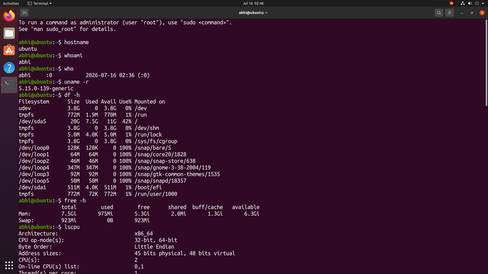
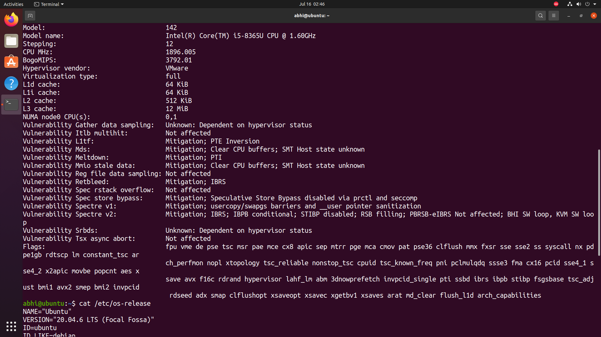
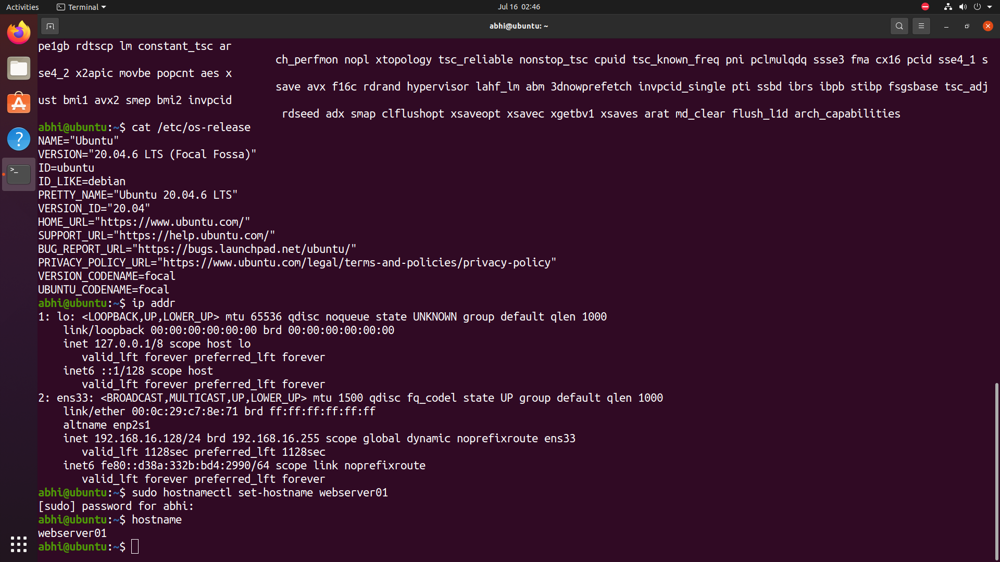

# 🖥️ System Information

> **Module 01** of the Linux Administration Lab

## 📖 Overview

Before configuring any Linux server, it is important to gather essential system information. This helps administrators understand the server environment, hardware resources, operating system, and network configuration before performing administrative tasks.

---

## 🎯 Objectives

In this lab, you will learn how to:

- Check the current hostname
- Identify the logged-in user
- View active login sessions
- Display the Linux kernel version
- Check disk usage
- Monitor memory utilization
- Display CPU information
- Identify the Ubuntu version
- View network interface information
- Change the hostname

---

# 📋 Commands Used

```bash
hostname
whoami
who
uname -r
df -h
free -h
lscpu
cat /etc/os-release
ip addr
sudo hostnamectl set-hostname webserver01
hostname
```

---

# 📸 Lab Execution

## Screenshot 1 – Basic System Information

The following commands were executed to collect basic server information:

- `hostname`
- `whoami`
- `who`
- `uname -r`
- `df -h`
- `free -h`
- `lscpu`



---

## Screenshot 2 – Operating System Information

The following command was used to identify the installed Ubuntu version and operating system details.

- `cat /etc/os-release`

This screenshot also includes the remaining output from the CPU information command.



---

## Screenshot 3 – Network & Hostname Configuration

The following commands were executed:

- `ip addr`
- `sudo hostnamectl set-hostname webserver01`
- `hostname`

This verifies the server's IP address and confirms that the hostname was successfully changed.



---

# ✅ Outcome

After completing this lab, I successfully:

- Collected server information
- Verified the current user
- Identified the Ubuntu version
- Checked the Linux kernel version
- Monitored CPU, RAM, and disk usage
- Retrieved the server IP address
- Changed the hostname successfully

---

# 📁 Directory Structure

```text
01-system-information/
├── README.md
└── screenshots/
    ├── system-info-1.png
    ├── system-info-2.png
    └── system-info-3.png
```

---

# 🎓 Skills Practiced

- Linux System Information
- Ubuntu Server Administration
- System Monitoring
- Hardware Inspection
- Memory Monitoring
- Storage Monitoring
- Network Configuration
- Hostname Management
