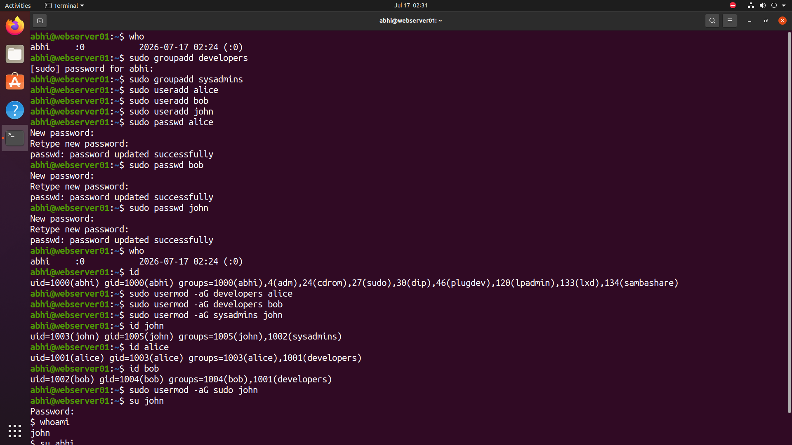

# 👥 User & Group Administration

> **Module 02** of the **Linux Administration Lab**

## 📖 Overview

User and Group Administration is one of the most important responsibilities of a Linux System Administrator. It enables administrators to create and manage user accounts, organize users into groups, assign administrative privileges, and maintain a secure multi-user environment.

---

## 🎯 Objectives

In this lab, I performed the following tasks:

- Created user groups
- Created multiple user accounts
- Set passwords for users
- Added users to groups
- Granted administrative (sudo) privileges
- Verified user and group information
- Switched between user accounts

---

## 💼 Scenario

As a Linux Administrator at **TechNova Pvt. Ltd.**, new employees have joined the Development and System Administration teams. Your responsibility is to create user accounts, organize them into appropriate groups, assign administrative privileges where required, and verify the configuration.

---

# 📋 Commands Used

```bash
# Create Groups
sudo groupadd developers
sudo groupadd sysadmins

# Create Users
sudo useradd alice
sudo useradd bob
sudo useradd john

# Set Passwords
sudo passwd alice
sudo passwd bob
sudo passwd john

# Add Users to Groups
sudo usermod -aG developers alice
sudo usermod -aG developers bob
sudo usermod -aG sysadmins john

# Grant Sudo Access
sudo usermod -aG sudo john

# Verify User Information
id alice
id bob
id john

# Switch User
su john
whoami
```

---

# 📸 Lab Execution

The screenshot below demonstrates the complete user and group management workflow, including:

- Creating user groups (`developers` and `sysadmins`)
- Creating users (`alice`, `bob`, and `john`)
- Setting passwords
- Adding users to groups
- Granting sudo privileges to `john`
- Verifying user and group memberships using the `id` command
- Switching to the `john` user and confirming the active user with `whoami`



---

# ✅ Outcome

After completing this lab, I successfully:

- Created Linux user accounts
- Created Linux groups
- Assigned users to appropriate groups
- Configured user passwords
- Granted administrative privileges
- Verified user and group memberships
- Switched between user accounts for validation

---

# 📁 Directory Structure

```text
02-user-group-administration/
├── README.md
└── screenshots/
    └── user-group-management.png
```

---

# 📚 Commands Practiced

```bash
groupadd
useradd
passwd
usermod
id
who
whoami
su
```

---

# 🎓 Skills Practiced

- Linux User Management
- Linux Group Management
- User Account Administration
- Group Membership Management
- Sudo Privilege Management
- User Verification

---

# 📌 Key Takeaways

- Learned how to create and manage Linux users and groups.
- Assigned users to appropriate groups using `usermod`.
- Granted administrative access through the `sudo` group.
- Verified user identities and group memberships using the `id` command.
- Practiced switching between user accounts to validate configurations.

---

## 🚀 Next Module

➡️ **03 - Directory & Permission Management**
