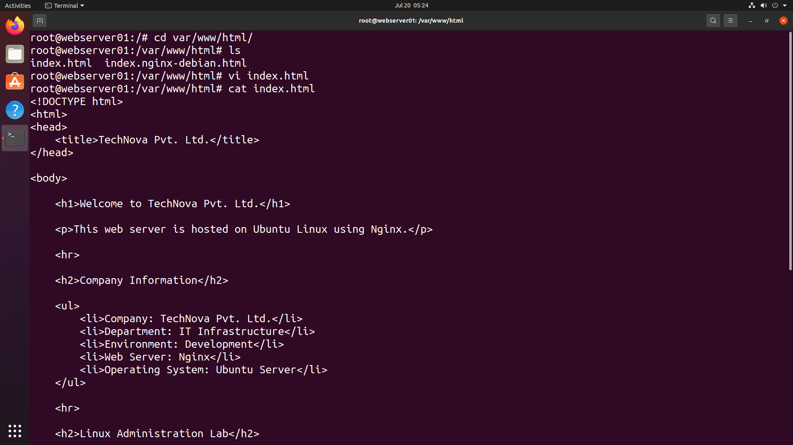
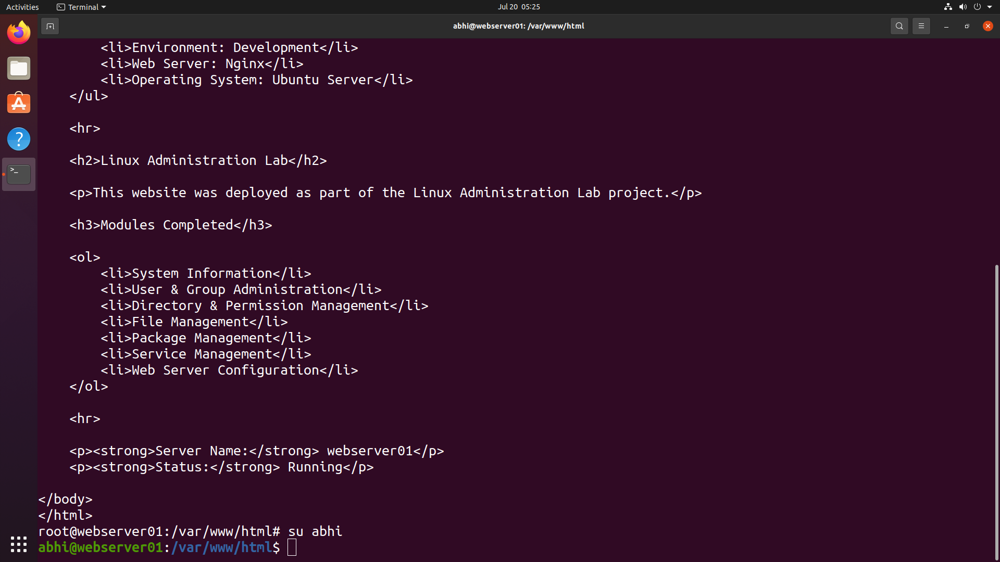
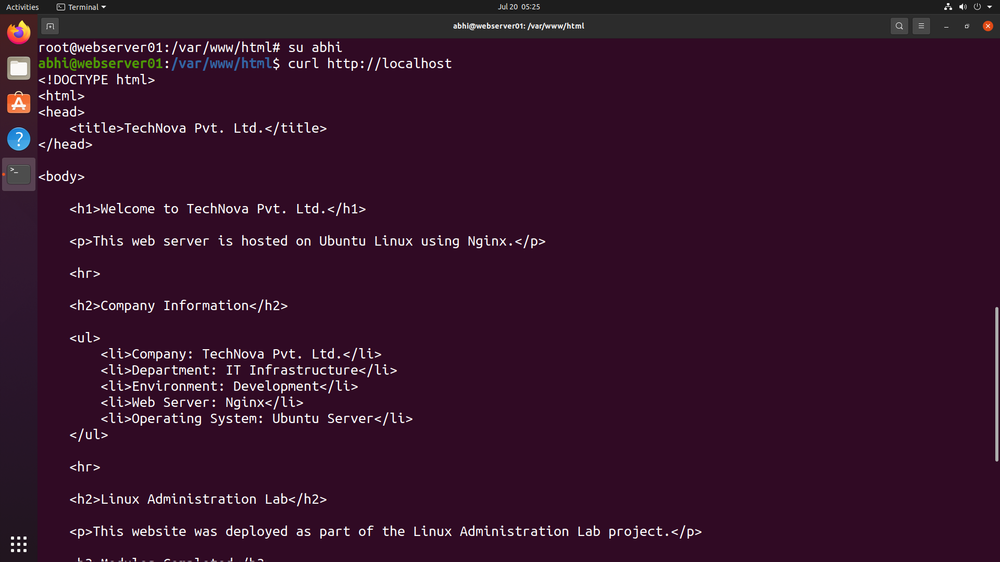
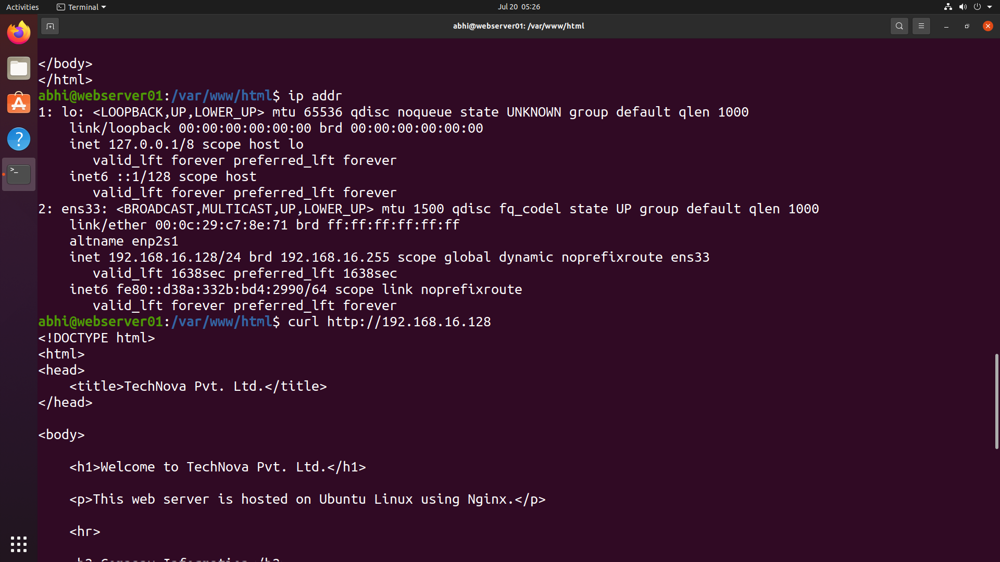
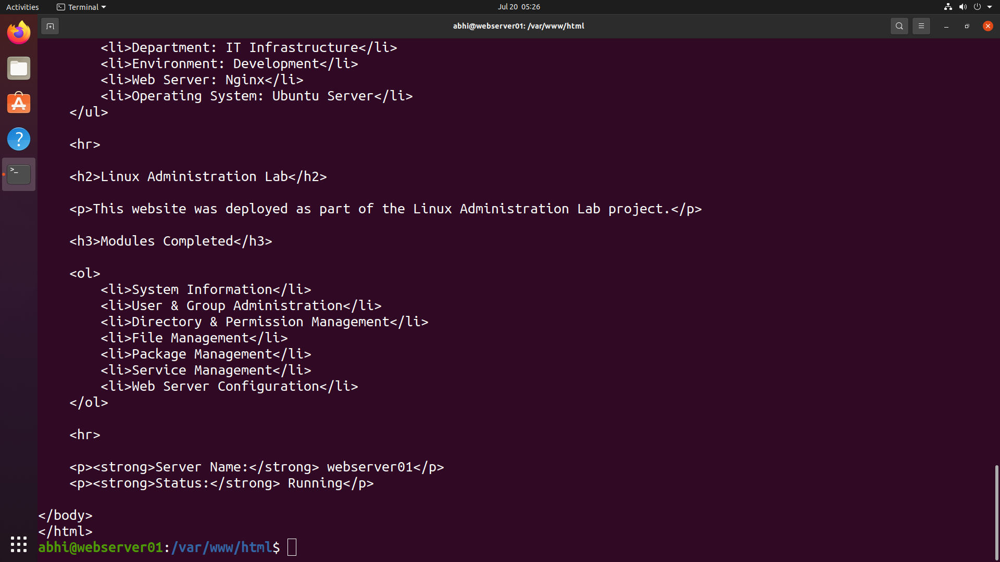

# 🌐 Web Server Configuration

> **Module 07** of the **Linux Administration Lab**

## 📖 Overview

Web Server Configuration is a key responsibility of a Linux System Administrator. In this lab, I configured the **Nginx** web server to host a custom company website, verified the deployed web page, and tested accessibility using both **localhost** and the server's IP address.

---

## 🎯 Objectives

In this lab, I performed the following tasks:

- Navigate to the Nginx web root
- View existing website files
- Create a custom company web page
- Verify website content
- Test website locally
- Verify server IP address
- Test website using the server IP

---

## 💼 Real-World Scenario

You are working as a **Linux System Administrator** at **TechNova Pvt. Ltd.**

The company requires a simple internal web portal hosted on an Ubuntu server using **Nginx**. Your responsibility is to deploy the website, verify the web page, and ensure it is accessible locally and over the network.

---

# 📋 Tasks Performed

## Task 1 – Navigate to the Web Root

Navigate to the default Nginx document root.

```bash
cd /var/www/html
```

List the available files.

```bash
ls
```

---

## Task 2 – Create a Custom Web Page

Edit the default web page.

```bash
sudo vi index.html
```

Created a custom HTML page containing:

- Company Name
- Company Information
- Linux Administration Lab Details
- Completed Modules
- Server Name
- Server Status

---

## Task 3 – Verify Website Content

Display the contents of the HTML file.

```bash
cat index.html
```

---

## Task 4 – Test Website Locally

Verify that Nginx serves the custom webpage.

```bash
curl http://localhost
```

---

## Task 5 – Verify Server IP Address

Display network interface information.

```bash
ip addr
```

---

## Task 6 – Test Website Using Server IP

Access the website through the server's IP address.

```bash
curl http://192.168.16.128
```

*(Replace `192.168.16.128` with your server's IP address if different.)*

---

# 📸 Lab Execution

## Screenshot 1 – Web Root and HTML Configuration

Completed the following tasks:

- Navigated to `/var/www/html`
- Listed website files
- Edited `index.html`
- Verified HTML source





---

## Screenshot 2 – HTML Page Content

Displayed:

- Company information
- Linux Administration Lab details
- Completed modules
- Server information





---

## Screenshot 3 – Local Website Verification

Completed the following tasks:

- Switched back to the regular user
- Tested the website using `curl`
- Verified the custom HTML page was served





---

## Screenshot 4 – Server IP Verification

Completed the following tasks:

- Displayed server IP address
- Identified active network interface





---

## Screenshot 5 – Website Access via Server IP

Completed the following tasks:

- Accessed the website using the server IP
- Verified successful page delivery





---

# 📁 Repository Structure

```text
07-web-server-configuration/
├── README.md
└── screenshots/
    ├── web-root-configuration.png
    ├── website-content.png
    ├── local-website-test.png
    ├── server-ip.png
    └── website-ip-test.png
```

---

# 📚 Commands Practiced

```bash
cd
ls
vi
cat
curl
ip addr
```

---

# 🌐 Commands Explained

| Command | Purpose |
|----------|----------|
| `cd /var/www/html` | Navigate to the Nginx document root |
| `ls` | List website files |
| `vi index.html` | Edit the default web page |
| `cat index.html` | Display HTML source code |
| `curl http://localhost` | Test website locally |
| `ip addr` | Display network interface and IP information |
| `curl http://<server-ip>` | Test website using the server's IP address |

---

# 🎓 Skills Practiced

- Nginx Web Server Administration
- Website Deployment
- HTML Configuration
- Linux File Management
- Local Website Testing
- Network Connectivity Testing
- Server Verification

---

# ✅ Outcome

After completing this lab, I successfully:

- Configured the Nginx document root.
- Created a custom company web page.
- Verified the HTML source code.
- Tested website accessibility using **localhost**.
- Identified the server's IP address.
- Verified website accessibility using the server IP.
- Confirmed successful deployment of the company website.

---

# 📌 Key Takeaways

- Learned the default Nginx web directory structure.
- Deployed a custom HTML website.
- Verified website functionality using `curl`.
- Used network commands to identify the server IP.
- Confirmed that the website was accessible both locally and remotely.
- Gained hands-on experience in basic web server administration.

---

## 🚀 Next Module

➡️ **Module 08 – Firewall Administration (UFW)**
